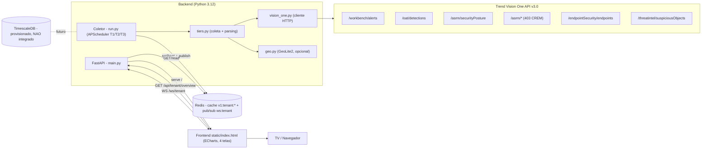
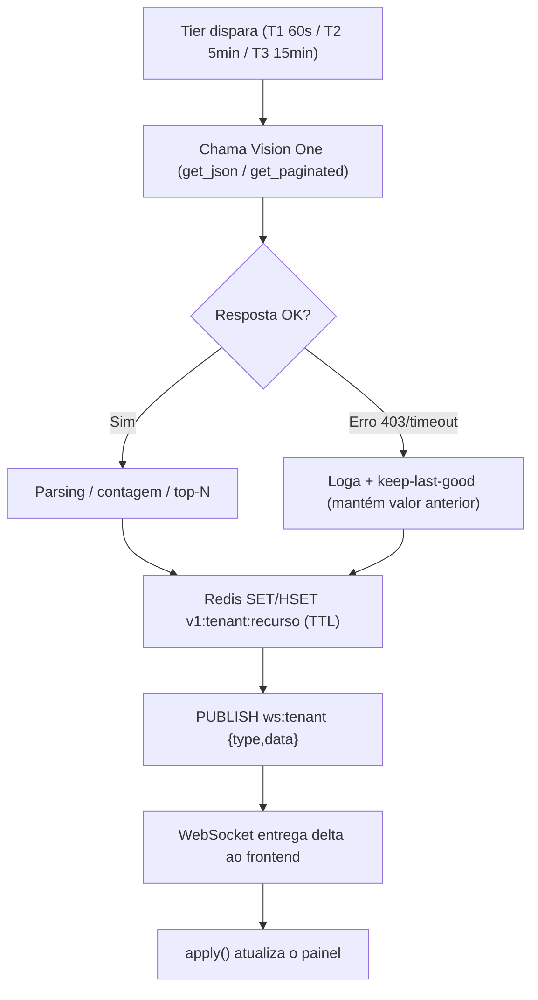
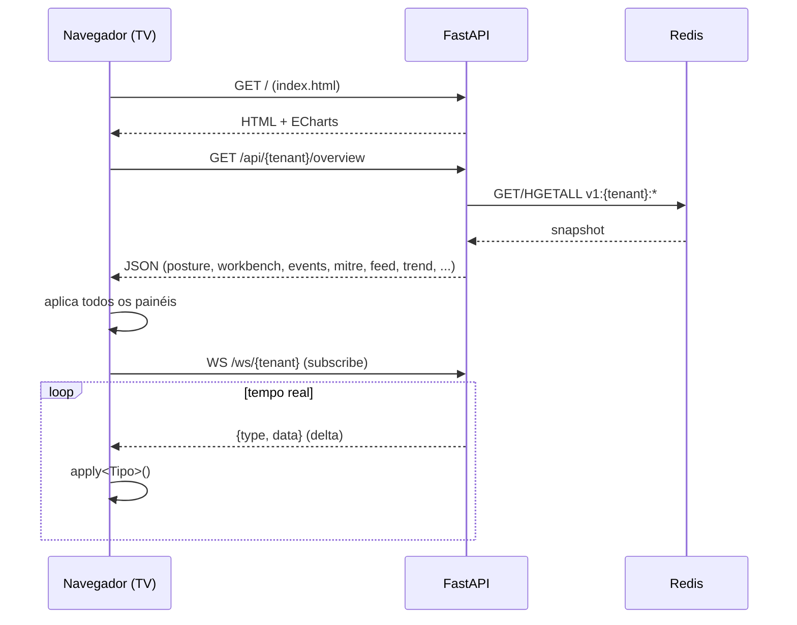
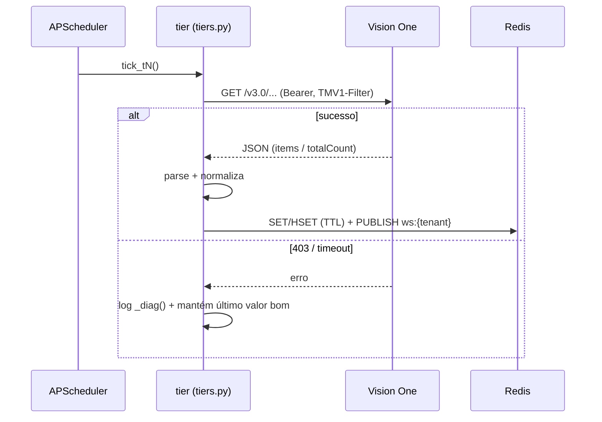

# 5. Arquitetura Geral

## Visão
Sistema de **coleta → cache → apresentação** em tempo real. Um processo coletor consulta a API do
Trend Vision One em intervalos escalonados (tiers), grava agregados no Redis e publica deltas em um
canal pub/sub. A API FastAPI lê o Redis para responder o snapshot (`overview`), retransmite os deltas
por WebSocket e serve o dashboard estático na mesma origem. O frontend (HTML único com ECharts)
hidrata no boot via HTTP e depois recebe atualizações via WebSocket.

## Componentes e responsabilidades
| Componente | Arquivo | Responsabilidade |
|---|---|---|
| **Coletor/Scheduler** | `collectors/run.py` | Orquestra tiers (APScheduler), grava no Redis, publica deltas, faz keep-last-good |
| **Tiers de coleta** | `collectors/tiers.py` | Chamadas à API V1 + parsing/normalização (workbench, posture, OAT, ASRM, endpoints, IOC) |
| **Cliente V1** | `app/vision_one.py` | HTTP Bearer, `get_json` (retry 429 c/ backoff), `get_paginated` (nextLink) |
| **API + estático** | `app/main.py` | `GET /healthz`, `GET /api/{tenant}/overview`, `WS /ws/{tenant}`, mount de `static/` em `/` |
| **Cache/PubSub** | `app/cache.py` + Redis | Cache quente (`v1:{tenant}:*`) e canal `ws:{tenant}` |
| **Geo** | `app/geo.py` + GeoLite2 | Enriquecimento geográfico de IOCs (lazy; opcional) |
| **Config** | `app/config.py` | Settings via `.env` (pydantic-settings) |
| **Frontend** | `static/index.html` | 4 telas ECharts; consome overview + WebSocket |
| **Banco (provisionado)** | `infra/init.sql` + TimescaleDB | Schema histórico — **NÃO integrado ao código** |

## Comunicação e protocolos
- **Coletor → Vision One:** HTTPS REST v3.0, header `Authorization: Bearer <token>`, filtros por
  header `TMV1-Filter`, paginação por `nextLink`.
- **Coletor → Redis:** comandos `set`/`hset` (com `expire`) e `publish` no canal `ws:{tenant}`.
- **Frontend → API:** `GET /api/{tenant}/overview` (JSON) no boot; `WS /ws/{tenant}` para deltas.
- **API → Frontend (estático):** `/` serve `static/index.html` (mesma origem → sem CORS).

## Fluxo das informações
1. Tier chama a API V1 e recebe JSON.
2. Tier normaliza (parsing, contagens, top-N) e devolve um dict/lista.
3. `run.py` grava no Redis (`set` JSON ou `hset` hash) com TTL e `publish` do delta.
4. Boot do frontend: `fetch` do `overview` → aplica todos os painéis.
5. Deltas: WebSocket recebe `{type, data}` → função `apply<Tipo>` atualiza o painel correspondente.

## Dependências externas
- **Trend Vision One API v3.0** (obrigatória) — fonte de todos os dados.
- **MaxMind GeoLite2-City** (opcional) — geolocalização do mapa.
- **Google Fonts** (Oxanium/Inter/JetBrains Mono) — carregadas por CDN no `index.html`
  (REQUER VALIDAÇÃO se há necessidade de empacotar as fontes para operar offline).

## Pontos de entrada e saída
- **Entradas:** API V1 (dados), `.env` (config/segredos), navegador (consumo do dashboard).
- **Saídas:** dashboard em `http://localhost:8000/`, `overview` JSON, deltas WebSocket, logs do coletor.

## Ambientes
- **Desenvolvimento/operação atual:** Windows 11 + WSL2 (Ubuntu), Docker Desktop, execução manual
  (coletor + uvicorn em terminais separados). Dashboard exibido em TV via navegador (F11/kiosk).
- **Homologação:** `NÃO IDENTIFICADO`.
- **Produção:** `REQUER VALIDAÇÃO` — há um `Dockerfile` (`uvicorn ... --workers 2`) e um guia de
  produção (`Guia-Implantacao-Producao-VisionOne.md`), mas o processo produtivo efetivo não está
  confirmado (Nginx, systemd, IIS foram citados em materiais, sem confirmação de qual está em uso).

## Estratégia de implantação (atual)
Ligar: `docker compose up -d` (infra) → coletor (`python -m collectors.run`) → API
(`uvicorn app.main:app`). Desligar: `Ctrl+C` nos processos + `docker compose stop` (nunca `down -v`).
Atalhos Windows: `ligar-dashboard.bat` / `desligar-dashboard.bat`.

---

## Diagrama — Arquitetura geral

## Diagrama — Fluxo de dados (coleta → cache → tela)

## Diagrama — Sequência de boot do dashboard

## Diagrama — Sequência de um tick de coleta

