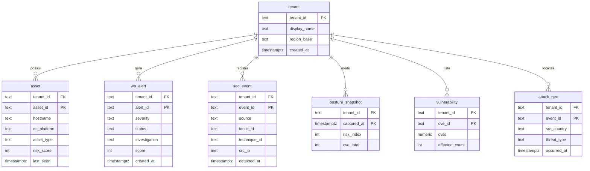

# 7. Banco de Dados

## Situação atual (IMPORTANTE)
O **TimescaleDB** (PostgreSQL + extensão TimescaleDB) está **provisionado** (schema completo em
`infra/init.sql`, executado automaticamente pelo Postgres no **primeiro start** com volume vazio),
mas **NÃO é usado pelo código atual**: nenhum tier escreve no banco, e o `app/main.py` lê **apenas do
Redis**. `asyncpg` está no `requirements.txt` porém sem uso. O "estado quente" do dashboard vive todo
no **Redis** (efêmero, TTL curto). Persistência histórica é **fase futura** (ver ROADMAP.md).

- **Tecnologia:** PostgreSQL + TimescaleDB (hypertables, continuous aggregates, políticas de retenção).
- **Conexão prevista:** `DB_DSN` (ex.: `postgresql://<user>:<pass>@localhost:5432/socdash`), via `asyncpg` (não integrado).
- **Localização do schema:** `infra/init.sql` (`REQUER VALIDAÇÃO` do caminho exato e da montagem no compose).

## Tabelas (definidas em `init.sql`)
| Tabela | Finalidade | PK | Hypertable (coluna de tempo) |
|---|---|---|---|
| `tenant` | Dimensão de clientes/tenants (multi-cliente) | `tenant_id` | — |
| `asset` | Dimensão de ativos (endpoints/servidores) | `(tenant_id, asset_id)` | — |
| `wb_alert` | Fato: alertas do Workbench | `(tenant_id, alert_id, created_at)` | `created_at` |
| `sec_event` | Fato: evento canônico (detections/oat/activities) | `(tenant_id, event_id, detected_at)` | `detected_at` |
| `posture_snapshot` | Fato: Risk Index ao longo do tempo | `(tenant_id, captured_at)` | `captured_at` |
| `vulnerability` | Fato: CVEs por ativo/tempo | `(tenant_id, cve_id, captured_at)` | — |
| `attack_geo` | Fato: eventos geolocalizados (Attack Map) | `(tenant_id, event_id, occurred_at)` | `occurred_at` |

### Campos-chave por tabela
- **tenant:** `tenant_id` (ex. `prodesp-sp`), `display_name`, `region_base` (default `https://api.xdr.trendmicro.com`), `created_at`.
- **asset:** `asset_id` (agentGuid), `hostname`, `os_platform` (windows|mac|linux|unix), `asset_type` (endpoint|server|workload|cloud), `epp_status`, `edr_conn`, `risk_score`, `last_seen`.
- **wb_alert:** `severity`, `status` (Open|In Progress|Closed), `investigation` (True/False/Benign True Positive...), `score`, `model`, `created_at`, `updated_at`.
- **sec_event:** `source` (workbench|oat|detection|network|email|identity), `severity`, `technique_id` (Txxxx), `tactic_id` (TAxxxx), `endpoint_guid`, `src_ip`/`dst_ip` (INET), `dst_port`, `verdict` (blocked|detected|allowed), `detected_at`, `raw` (JSONB).
- **posture_snapshot:** `risk_index` (0–100), `exposure_lvl`, `attack_lvl`, `config_lvl`, `cve_total`.
- **vulnerability:** `cve_id`, `cvss` NUMERIC(3,1), `severity`, `affected_count`.
- **attack_geo:** `src_country/src_city/src_lat/src_lon`, `dst_country/dst_lat/dst_lon`, `threat_type`, `severity`.

### Índices, agregações e retenção
- Índices: `ix_event_tactic (tenant_id, tactic_id, detected_at DESC)`, `ix_event_source (tenant_id, source, detected_at DESC)`.
- **Continuous aggregate:** `sec_event_hourly` (`time_bucket('1 hour', detected_at)`, contagem por tenant/source/severity); policy a cada 5 min (offset 30 dias → 1 hora).
- **Retenção:** `add_retention_policy('sec_event', INTERVAL '30 days')` (telemetria bruta 30 dias).
- **Seed:** `INSERT tenant ('prodesp-sp','Prodesp')` (idempotente); exemplos comentados (IMA, Poupatempo, Secretaria Digital).

## Como os dados entrariam (fase futura, ainda NÃO implementada)
O coletor (`collectors/run.py`) — que hoje só grava no Redis — passaria a **também** persistir:
`posture_snapshot` (a cada tick T1), `sec_event`/`wb_alert` (normalizando OAT/workbench), `vulnerability`,
`attack_geo`. Isso habilitaria tendências de longo prazo (hoje o `event_tallies` 7d/30d é contagem
pontual, sem série histórica). Requer camada de acesso `asyncpg` + escrita idempotente (upsert por PK).

## Diagrama entidade-relacionamento

## Cache Redis (o "estado" real de hoje)
Ver `BACKEND.md` (tabela de chaves `v1:{tenant}:*` + TTLs). É o armazenamento efetivo do dashboard;
volátil por design (o coletor reabastece a cada tick).
